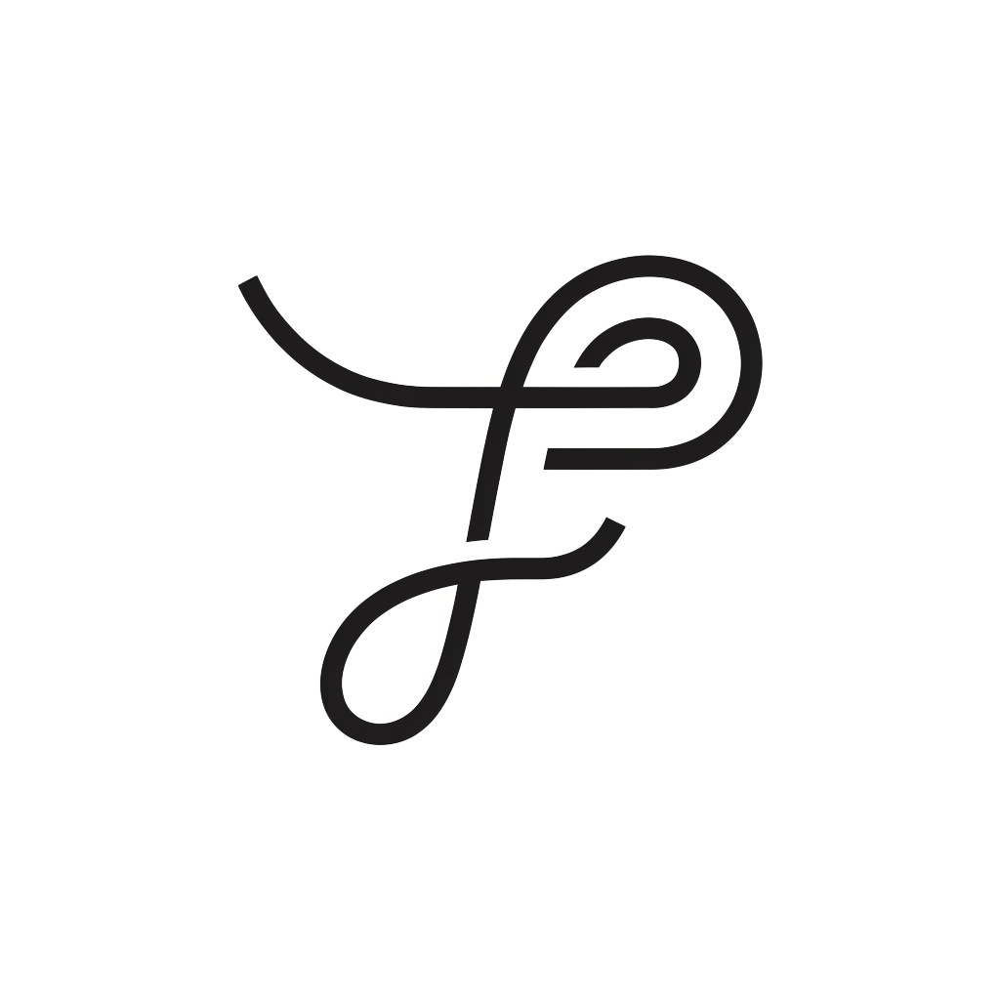

# Fit Passport Logo 设计理念

**暂定概念名：** The Fit Thread / Ariadne Thread Signet（合身之线 / 阿里阿德涅之线印记）  
**当前首选方向：** 从四宫格左上角方案中独立提取的标志  
**当前状态：** 已获得透明背景和白色背景 PNG，可用于展示与原型；正式矢量母版仍待制作  
**最后更新：** 2026 年 8 月 27 日

> **一个身体。一份合身身份。适用于任何商店。**  
> **一根线，穿过合身的迷宫。**

English edition: [LOGO_CONCEPT.md](LOGO_CONCEPT.md)  
PDF 版本：[LOGO_CONCEPT.zh-CN.pdf](LOGO_CONCEPT.zh-CN.pdf)



*当前选定标志。独立 PNG 可用于概念记录和近期原型；最终 Logo 仍需重新制作成干净的矢量文件。*

## 1. 品牌与产品基础

Fit Passport 是一份**由消费者拥有、能够跨平台携带的合身身份**。它记录用户的身体数据、版型偏好、已经合身的衣物，以及过去购买、保留、退换和重新评价的结果。这份记忆属于消费者，可以跨越不同品牌与商店，而不是被锁在某一家零售商内部。

因此，Logo 不应该只代表测量、衣服或购物，而应该表达一个更持久的核心观念：

> **每个人都可以带走并持续积累“什么真正适合自己”的记忆。**

Logo 的气质必须以时尚为先，而不是以科技为先：编辑感、克制、精致、个人化、不过时、有剪裁感、性别中立，并具有安静的高级感。即使 Fit Passport 未来从服装延伸到鞋履、戒指、宠物用品或其他依赖尺码的品类，这一标志仍然应当成立。

## 2. 当前首选造型

左上角方案是一条连续的、近似纺织线的路径，最终形成抽象的 **FP** 字母组合。左侧进入的线头、上方的圆形转折、字母之间共享的结构以及下方延伸的环线，共同制造出流动感，却没有直接画出某个具象物体。

这一造型可以同时承载多层含义：

| 视觉线索 | 品牌含义 |
|---|---|
| 一条连续的线 | 一份合身身份跨越许多商店持续存在 |
| 纺织线 | 服装、制作、连续性与被记住的穿着经验 |
| 经过转折的路径 | 在不一致的尺码体系中寻找方向 |
| 抽象的 FP | 明确属于 Fit Passport 的识别资产 |
| 折叠的织带或标签 | 服装结构、时尚语言与翻动的护照页面 |
| 紧凑的印记 | 个人身份、验证与由用户拥有的记录 |

标志应当保持“可被联想到”，而不是变成字面插画。它的价值正来自这些意义能够同时存在。

## 3. 核心神话：阿里阿德涅之线

在希腊神话中，阿里阿德涅把线交给进入迷宫的忒修斯，让他沿途放线，从而找到离开迷宫的道路。大都会艺术博物馆在对忒修斯故事的介绍以及相关藏品中都记录和呈现了这一情节。

这则典故与 Fit Passport 的产品逻辑有自然的对应关系：

| 神话意象 | Fit Passport 中的对应 |
|---|---|
| 迷宫 | 互相冲突的尺码标签、地区体系与品牌版型 |
| 线 | 用户逐渐积累的合身记忆 |
| 已经走过的路线 | 试穿、保留、退货、换货和重新评价过的衣物 |
| 引导人离开的路径 | 基于历史证据、能够说明原因的尺码建议 |
| 阿里阿德涅的智慧 | 帮助用户找到方向，但不夺走用户对身份和数据的拥有权 |

品牌叙事应当强调**阿里阿德涅提供方向、记忆和方法**，而不是强调弥诺陶洛斯故事中的暴力。面对用户时，可以把故事浓缩为一句话：

> **跨越不同品牌时，尺码会变成一座迷宫；Fit Passport 为你保留那根线。**

我们不是在宣称这枚 FP 图形是某种古希腊符号。神话只是理解当代 Logo 和产品价值的一种叙事视角。

## 4. 材质隐喻：织梭与织造

在传统织毯工艺中，纬线被梭子带着反复穿过经线，最后逐渐形成图案。这为 Logo 提供了第二层更贴近服装材质的解释。

每一次购买或穿着结果，都像纺织过程中的一次穿线。长期积累以后，这些经历会织出一套属于个人的合身规律；它比任何孤立的 S、M、L 或数字尺码都更有价值。

首选 Logo 只需要**隐约让人想到**织梭、线环或折叠的纺织物，不应该变成写实的针线工具、线轴或手工艺商店图标。

## 5. 身份隐喻：个人印记

第三层含义来自印章、签章和护照印记。Fit Passport 不是一个临时的尺码推荐按钮，而是一层由消费者拥有的身份。紧凑的 FP 组合标志可以像个人印记一样出现在：

- Fit Passport 身份卡；
- 导出的 Passport 图片；
- 已验证的合身记录；
- 个人资料头像和会员标识；
- 衣物证据与推荐依据；
- 未来的实体标签、卡片或活动物料。

它需要具有可信度和身份感，但不能显得像政府机构、证件管理系统或安全软件。

## 6. 辅助造型参考

### 折叠织带与服装标签

这根线可以让人想到折回的布料、服装标签，或者正在翻动的护照页面。这样既能连接时尚与“可携带”的概念，又不需要直接画衬衫、衣架、卷尺或护照本。

### 连续路径与回纹节奏

古典回纹通过连续的转折形成节奏。Logo 可以借用“路径即使经过变化仍不中断”的形式感觉，但不能直接复制历史纹样，也不应该做成字面的迷宫。

### 合身是一种持续累积的记忆

Logo 不是静态的测量结果，而是一条不断延续的路径：新的穿着观察会被加入，偏好会变化，身体也会变化，个人档案则持续学习。因此，连续的线比尺子或人体轮廓更准确地代表产品。

## 7. Logo 不应该变成什么

后续精修必须避免让首选概念被误读为：

- 锤子、雷神锤、斧头或其他武器；
- 雨伞、钥匙、旗子、蘑菇或字母 T；
- 写实的迷宫、线轴、针、衣架、人体模型或护照；
- 常见的科技循环、链条、金融科技图标；
- 被包装成“真实古代符号”的装饰性希腊纹样。

阿里阿德涅之线与我们的产品逻辑一致，而雷神锤并不一致。力量、战斗与北欧奇幻会把品牌带向游戏或男性运动品牌，偏离时尚、记忆与个人合身体验。

## 8. 后续精修原则

最终矢量版本应保留左上角方案的性格，同时解决光学平衡和生产可用性。

1. 保留“一根连续的线”的感觉。
2. 保留左侧开放的入口和下方延伸的环线。
3. 让 FP 可以被发现，但不要像普通字体组合一样直白。
4. 避免过重、过长的顶部横条，也避免形成正中的“锤柄”。
5. 使用干净、有意识的贝塞尔曲线和视觉上统一的线宽。
6. 去除位图模糊、意外交叉、阴影、灰色高光和渐变。
7. 正式版本尽量控制在一至三条主要路径内。
8. 在 16、24、32、48 和 128 像素下分别测试。
9. 制作纯黑、反白、轮廓版和微型图标版。
10. 先确认黑白轮廓成立，再引入颜色。

## 9. 动效系统

左上角方案的重要价值，在于它可以从静态逻辑自然发展成动画，不需要另外发明一套动效语言。

### 主动画：线条绘制

1. 一根线从左侧进入画面。
2. 线经过上方转折，形成隐藏的 FP 结构。
3. 下方环线完成整枚身份标志。
4. Logo 以克制、类似织物的缓动轻轻稳定下来。

建议时长：界面出现动效为 **600-900 毫秒**；品牌片头为 **1.2-1.8 秒**。

### 辅助动画

- **折叠展开：** 某一段像服装标签或护照页一样轻轻翻开。
- **印记压下：** 用于完成、验证或确认状态的轻微下压与回弹。
- **线条脉冲：** 用于加载或档案学习状态的克制路径高光。

动效应当安静、有编辑感。避免持续旋转、霓虹轨迹、夸张卡通弹性或沉重的 3D 模拟。

## 10. 先黑白，后颜色

Logo 母版必须先在纯黑和纯白环境中通过。颜色的作用是强化品牌，而不是拯救不成立的几何结构。

### 基础中性色

| 用途 | 颜色 | 色值 |
|---|---|---|
| 主墨色 | Ink Black | `#171416` |
| 浅色背景 | Warm Ivory | `#F3EFE7` |
| 反白 | White | `#FFFFFF` |

### 黑白轮廓通过后再测试的强调色

| 候选色 | 色值 | 预期气质 |
|---|---|---|
| Oxblood 牛血红 | `#781F2B` | 首选品牌强调色；成熟、编辑感、时尚导向 |
| Deep Aubergine 深茄紫 | `#2B172C` | 艺术、夜间感、克制的高级感 |
| Ultramarine 群青 | `#2737B8` | 当代艺术与秀场能量；需控制用量以免产生科技感 |

建议从 **Ink Black + Warm Ivory + Oxblood** 开始。金属效果属于未来的徽章和 Passport 材质系统，不应进入主 Logo 母版。

## 11. 应该保存哪些 Logo 格式

### 唯一母版

正式 Logo 应当以可编辑矢量为源文件：

- **Figma Component：** 用于团队协作、布局和设计系统；
- **SVG：** 作为数字产品中的标准导出格式；
- **矢量 PDF 或 EPS：** 在印刷供应商确实需要时提供。

### 最终交付包

| 格式 | 使用场景 | 注意事项 |
|---|---|---|
| SVG | 网站、App、动效和可缩放界面 | 首选生产格式；优化压缩的同时保留可编辑母版 |
| PNG | 社交头像、文档、不接受 SVG 的系统 | 导出透明背景的 1x、2x 和 4x 版本 |
| WebP/AVIF | 网页中的大型位图后备方案 | 小型 Logo 通常不需要 |
| 矢量 PDF | 印刷、演示文稿和供应商交付 | 保留矢量路径与正确颜色配置 |
| EPS | 旧式印刷或供应商流程 | 只有对方明确要求时再提供 |
| ICO | Windows 浏览器图标 | 应从专门的微型图标版生成 |

不要把 JPG 作为 Logo 母版。JPG 没有透明背景，并且会在边缘产生压缩痕迹。

## 12. 如何提取左上角 Logo

目前已经有两份 1024 × 1024 的独立 PNG：

- `fit-passport-logo-concept-transparent.png` - 带透明通道的 RGBA 文件，适合近期原型和文档；
- `fit-passport-logo-concept-white.png` - 白色背景 RGB 文件，适合普通演示文稿和参考图。

透明版本保留了较充足的画布留白，实际可见图形约占 538 × 503 px，位于画布中央。这两份文件已经是很实用的交付资产，但依然属于位图，不能直接取代可编辑的矢量母版。

### 最佳方法：回到生成它的原始设计文件

1. 打开 Recraft 或原始设计项目。
2. 只选中左上角图形。
3. 以透明背景 SVG 导出。
4. 把 SVG 导入 Figma。
5. 先保留一个可以继续调整线宽的版本，再复制一份将描边转为轮廓。
6. 删除隐藏对象、蒙版、重复节点、渐变和杂散形状。
7. 在 800%-1600% 放大比例下手动调整曲线和交汇处。
8. 为 16 px 场景单独制作经过光学调整的微型版本，而不是机械缩小完整 Logo。

### 如果最终只剩下 PNG

1. 直接使用已提取的透明 PNG，不再从原四宫格概念图二次裁剪。
2. 放入 Figma，降低透明度并锁定为参考层。
3. 使用 Pen Tool 手动重建路径；不要把一键位图描摹的结果直接当最终文件。
4. 尽量减少锚点数量。
5. 统一曲线切线和视觉线宽。
6. 在复制的 Frame 中把描边转为轮廓。
7. 同时在 16 px 和大尺寸印刷环境中检查交汇与负空间。

自动矢量化可以作为起点，但通常会制造过多节点，并保留 PNG 的模糊和不规则。对于这样简单的 Logo，最终必须手动重建。

## 13. 建议的仓库资产结构

```text
app-web/public/brand/
  logo-mark.svg
  logo-mark-reverse.svg
  logo-mark-micro.svg
  logo-lockup-horizontal.svg
  logo-lockup-stacked.svg
  favicon.svg
  favicon.ico
  logo-mark-512.png

docs/design/brand/
  fit-passport-logo-master.fig      # 视情况存放链接或导出参考
  fit-passport-logo-print.pdf
  fit-passport-logo-outline.svg
```

网站应优先引用 SVG，而不是嵌入大型 PNG 或 3D 文件。经过合理清理和优化的简单 Logo SVG 通常只需要几 KB。

## 14. 应用规则

### 安全空间

以图形内部主要线宽作为四周最小安全距离。在海报或编辑式版面中应给予更大的留白。

### 最小尺寸

- 完整图形：在小尺寸测试完成前，不建议低于 **24 px**。
- 微型图标：目标为 **16 px** 和 favicon。
- 印刷：应确认在约 **8 mm** 宽度下线条仍能完整呈现。

### 背景

- Warm Ivory 或白色背景使用 Ink Black。
- Ink Black 或足够深的照片背景使用反白版本。
- 只有黑白版本通过后，才使用 Oxblood。
- 不要为了增加对比而临时添加投影、发光、斜面或外描边。

### 组合形式

需要维护独立、经过批准的文件：

- 仅图形；
- 图形 + “Fit Passport” 横向字标；
- 上下堆叠组合；
- 微型图标；
- 动画源文件。

产品界面中不应临时随意输入文字来代替正式字标。

### 与徽章系统的关系

徽章未来可以使用金属深度、材质纹理和等级颜色，并继承 Logo 中“线与路径”的几何语言。但徽章不应反过来迫使主 Logo 变成 3D。主 Logo 保持扁平、轻量；更丰富的立体表现交给徽章系统。

## 15. 生产检查清单

- [ ] 获取或手动重建左上角方案的真实矢量文件。
- [ ] 在 Figma 或 Illustrator 中完成曲线的光学清理。
- [ ] 减少路径和锚点数量。
- [ ] 批准黑底白标与白底黑标。
- [ ] 在 16/24/32/48/128 px 以及 8 mm 印刷宽度下测试。
- [ ] 排查锤子、雨伞、钥匙、旗子和字母 T 等误读。
- [ ] 制作仅图形、横向、堆叠和微型版本。
- [ ] 黑白版本通过后再选择一个强调色。
- [ ] 导出 SVG、PNG、矢量 PDF、favicon 和动效源文件。
- [ ] 优化 SVG，并在产品中检查无障碍和对比度。
- [ ] 正式公开发布前进行专业的商标近似检索。

## 16. 核心品牌语言

### 推荐对外短句

> **一根线，穿过合身的迷宫。**

### 产品解释

> 跨越不同品牌时，尺码会变成一座迷宫。Fit Passport 为你保留那根线：你穿过什么、感受如何、什么真正适合你。Logo 是一根折叠成 FP 的线，也是一枚属于个人的印记，引导你重新找到适合自己的选择。

### 内部创意定义

> Logo 不是一件衣服的图案，而是那份能够穿过所有衣服继续存在的记忆。

## 参考资料

1. 大都会艺术博物馆，[“Theseus, Hero of Athens”](https://www.metmuseum.org/essays/theseus-hero-of-athens) - 介绍阿里阿德涅给忒修斯线团，使其能够离开迷宫的故事。
2. 大都会艺术博物馆，[描绘阿里阿德涅与忒修斯的古罗马石棺](https://www.metmuseum.org/art/collection/search/245585) - 藏品图像中呈现阿里阿德涅交出引路线的情节。
3. 大都会艺术博物馆，[“How Medieval and Renaissance Tapestries Were Made”](https://www.metmuseum.org/essays/how-medieval-and-renaissance-tapestries-were-made) - 介绍经线、纬线与手持织梭的历史工艺。
4. 大都会艺术博物馆，[回纹图案设计藏品](https://www.metmuseum.org/art/collection/search/454042) - 连续 Greek key / meander 节奏的历史实例。

---

*本文档用于记录品牌叙事与设计方向。它不主张对相关神话或历史纹样的所有权，也不能代替正式商标审查与最终矢量生产。*
